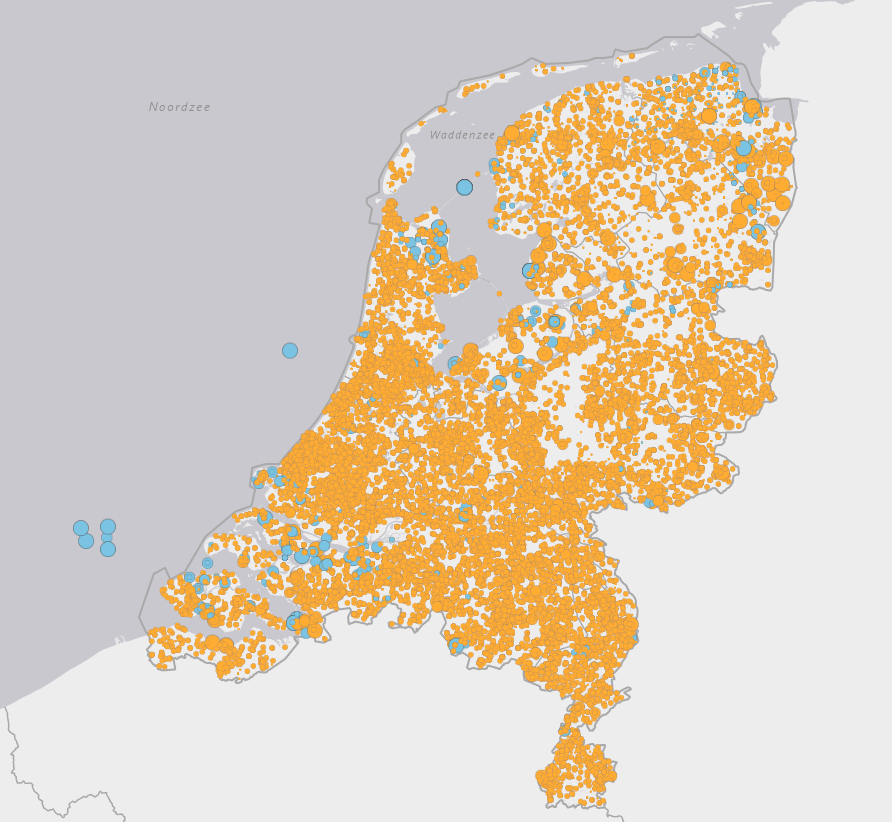

- Hier is de link: https://ez.maps.arcgis.com/apps/webappviewer/index.html?id=2c145fd01136450a8aff572cf78cac3b
- Bij lagen kun je de SDE projecten Wind en Zon aanzetten.
	- LATER ik ben benieuwd of ik die gevisualiseerde als een lijst kan downloaden in vervolgens kan inlezen in excel of pandas
		- Als ik de tab voor de SDE projecten aanzet, dan laad hij aantal protobuf bestanden, dus het lijkt me dat daar al die projecten inzitten.
		- Ik kan de query ook los uitvoeren, dan krijg ik een results.pbf file
	- 
- Hier is een groot XML bestand met alle RVO projecten: https://data.rvo.nl/sites/default/files/open_data/dop_projecten.xml
-